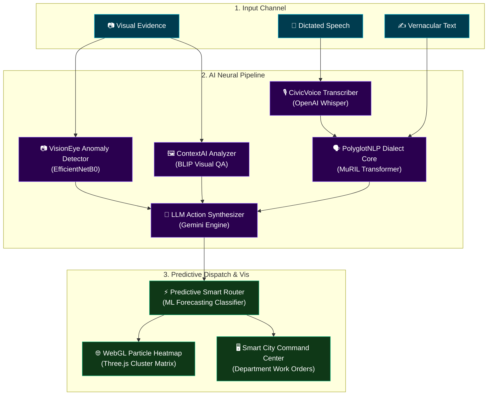

# 🏛️ Civic Connect

### *AI-Powered Neural Infrastructure & Grievance Routing for Modern Smart Cities*

[](https://nextjs.org/)
[](https://react.dev/)
[](https://tailwindcss.com/)
[](https://threejs.org/)
[](https://gsap.com/)

---

**Civic Connect** is an ultra-high-fidelity, state-of-the-art smart city governance and complaint routing dashboard. It integrates real-time 3D WebGL visualizations, advanced computer vision, multilingual natural language processing (NLP), and automatic LLM priority assignment to revolutionize how citizens report municipal failures and how city agencies respond.

The system transitions from an ambient, cinematic login flow directly into a dynamic dashboard wrapped in a custom scroll-driven 3D neural grid, rendering high-density city metadata at 60fps.

---

## 🗺️ Architectural Pipeline



---

## ✨ Premium Features

### 1. 🧬 Multi-Modal AI Core Showcase
*   **VisionEye Anomaly Detection:** Spatial grid damage parsing powered by EfficientNetB0, classifying visual anomalies across 8 categories (roads, drainage, garbage, water, streetlight, electricity, safety, traffic) instantly.
*   **ContextAI Multimodal Analyzer:** Image context extraction using **BLIP (Salesforce)** to generate automatic, descriptive summaries and tagging parameters for submitted imagery.
*   **PolyglotNLP Dialect Core:** Multilingual feedback processing leveraging **Google MuRIL (Multilingual Representations for Indian Languages)** transformer, supporting Telugu-English code-mixed text, Hindi, and regional dialects to democratize accessibility.
*   **Vision-Text Fusion Layer:** A true multimodal architecture that concatenates EfficientNetB0 visual features with MuRIL text embeddings through a learned fusion layer, then predicts both **department (8 classes)** and **priority (low/medium/high)** simultaneously.
*   **CivicVoice Transcriber:** Fast, seamless dictation interface leveraging **OpenAI Whisper (tiny)** for voice-based grievance registrations in Telugu, Hindi, and English.
*   **LLM Action Synthesizer:** Advanced municipal briefing generator that writes detailed maintenance instructions and outputs department priorities via OpenRouter/GPT-4o-mini.
*   **Predictive Smart Router:** Automated ML-powered priority routing to dispatch tickets directly to corresponding administrative wings (Roads, Drainage, Sanitation, Water Works, Electrical, Power, Safety, Traffic).

### 2. 🌌 High-Fidelity 3D Visual Experience
*   **Interactive 3D WebGL Canvas:** A dynamic Three.js + React Three Fiber backdrop containing dynamic particle systems representing a neural city net that floats and warps dynamically.
*   **WebGL Smart City Heatmap:** A visual WebGL plane showcasing active municipal complaints (hotspots for Potholes, Water Leaks, and Waste Clusters) that updates interactively with custom rendering blending.
*   **GSAP Scroll-Driven Transitions:** A comprehensive scrolling experience leveraging GreenSock ScrollTrigger and Lenis smooth scrolling that alters scale, blur, brightness, and color temperature of the entire platform relative to the scroll-depth.
*   **HLS Cinematic Background:** A fluid, custom ambient video player that utilizes Mux's adaptive streaming network (`hls.js`) to stream high-density cinematic startup imagery without choking thread bandwidth.

### 3. 👤 Dynamic RBAC Authentication & Profile
*   **Dual-Role Toggling Hub:** Integrated, pre-filled credential selector supporting **Smart City Lead Administrators** and **Validated Citizens**.
*   **Double CanvasRevealEffect Matrix:** Real-time WebGL shader matrices tracking entering steps, complete with reverse animation shaders that fade back out on successful auth.
*   **Spatial WarpTransition:** Interstellar warp effect using SVG masks and Framer Motion, easing users between the login screen and the live city grid.
*   **Interactive Terminal Logs:** Real-time visual debugger rendering mock SHA-256 digital handshakes, neural weight updates, and server events inside a retro-cyber glassmorphic terminal.

---

## 🛠️ Technology Stack

| Domain | Technology | Description |
| :--- | :--- | :--- |
| **Core Architecture** | Next.js 16.2.6 (App Router), React 19.2.4, TypeScript | Server and Client rendering pipeline |
| **3D Graphics** | `@react-three/fiber`, `@react-three/drei`, Three.js | High-performance WebGL particulate canvas |
| **Styling** | Tailwind CSS v4, Vanilla CSS Custom Tokens | Modern layout utility structure |
| **Motion Physics** | GSAP 3.15.0, ScrollTrigger, Framer Motion 12 | Fluid transitions & scroll-bound timelines |
| **Scrolling Physics**| Lenis 1.3 | Fluid, high-precision inertial scroll smoothing |
| **Dynamic Video** | Hls.js | Low-latency HLS stream player integration |
| **Icons & Elements** | Lucide React, Shadcn UI (Base elements) | Harmonized UI library assets |
| **Vision Model** | EfficientNetB0 (PyTorch) | Image feature extraction for 8-class civic issue classification |
| **Text Model** | Google MuRIL (Transformers) | Multilingual Telugu/English/Hindi text understanding |
| **Fusion Architecture** | Custom multimodal fusion layer | Concatenated vision + text features → department + priority heads |
| **Image Captioning** | Salesforce BLIP | Automatic image description generation |
| **Voice Transcription** | OpenAI Whisper (tiny) | Voice-to-text for grievance registration in Indian languages |

---

## 📂 Repository Blueprint

```bash
AnotherCivic/
├── public/                 # Static visual assets (logos, ambient images)
├── src/
│   ├── app/                # Next.js App Router Tree
│   │   ├── globals.css     # Global variables and scroll resets
│   │   ├── layout.tsx      # Main wrapper rendering GlobalBackground & Navbar
│   │   ├── page.tsx        # Login entrance (SignInPage)
│   │   ├── home/           # Main landing dashboard
│   │   └── profile/        # Interactive security/activity dashboard
│   ├── components/         # Shared components and visual zones
│   │   ├── canvas/         # R3F Canvas components (NeuralNetwork)
│   │   ├── sections/       # Feature sections (Hero, Technology, Heatmap, CommandCenter)
│   │   ├── ui/             # High fidelity UI controls (CinematicVideo, WarpTransition)
│   │   ├── Navbar.tsx      # Dropdown-embedded authentication monitor
│   │   └── SmoothScroll.tsx # Lenis wrapper initialization
│   └── lib/                # Code utility tools
```

---

## 🚀 Installation & Local Launch

### Prerequisites
Make sure you have Node.js 18+ and npm installed on your system.

### 1. Clone the Repository
```bash
git clone https://github.com/yash/AnotherCivic.git
cd AnotherCivic
```

### 2. Install Dependencies
```bash
npm install
```

### 3. Launch Development Server
```bash
npm run dev
```
Open [http://localhost:3000](http://localhost:3000) on your local browser to experience the platform.

### 4. Build Production Bundle
```bash
npm run build
npm run start
```

---

## 🔐 Credentials & Profiles Reference

To bypass authentication during testing, the login panel contains a segmented switch. You can also sign in manually using the default developer profile parameters:

*   **Default Dev Profile:**
    *   **Name:** `Yash`
    *   **Email:** `yash@civicai.org` (Treated as **Smart City Lead** admin)
    *   **Fallback Citizen Profile:** Any email that does not contain `"admin"` or `"yash"` (Treated as **Validated Citizen**)

> [!TIP]
> Navigating to `/profile` unlocks a dedicated interactive debugger terminal demonstrating real-time model weights uploading, citizen activity records, and certificate handshakes!
